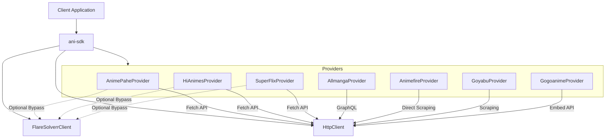

# Universal Media Scraper SDK (ani-sdk)

A highly optimized, extensible, and fully-typed Universal Media Scraper SDK written in modern TypeScript. Designed as a lightweight first-class library to fetch catalog indices, metadata, episode list mapping, and direct media stream URLs across multiple video platforms.

---

## Key Features

- 🚀 **Zero Heavy Dependencies**: Completely free of heavy browser automation frameworks (like Puppeteer) in production.
- 🛡️ **Cloudflare/DDoS-Guard Bypass** (optional): Uses a decoupled, Docker-based [FlareSolverr](https://github.com/FlareSolverr/FlareSolverr) proxy for bypassing Turnstile and DDoS-Guard challenges.
- 🎙️ **First-Class Sub/Dub Support**: Explicitly typed support for localized content languages (`'sub' | 'dub' | 'raw'`) throughout search and stream resolution.
- 📦 **Modern ESM Architecture**: Built using modern ES modules (ESM) with clean type definitions.
- ⚡ **Resilient Network Client**: Custom `HttpClient` wrapper supporting automatic request timeout settings and optional path/query proxy routing.

---

## Architecture & Design



---

## Supported Providers

| Provider ID | Target URL | CF / DDoS-Guard Bypass | Sub/Dub Support | Details |
|---|---|---|---|---|
| `allmanga` | `allmanga.to` | No (Direct GraphQL API) | Yes (Sub / Dub tabs) | High-speed GraphQL search & iframe stream resolver. |
| `animepahe` | `animepahe.pw` | **Yes (Required via FlareSolverr)** | Yes (Sub / Dub / JPN) | Obfuscated JS decryption for `kwik.cx` redirect streams. |
| `hianimes` | `hianimes.se` | **Yes (Required via FlareSolverr)** | Yes (Sub / Dub categories) | Zoro/Aniwatch Next.js scraper utilizing server-render payloads. |
| `superflix` | `superflixapi.best` | **Yes (Required via FlareSolverr)** | Yes (Subbed Default) | Direct extraction of video streams from page script variables. |
| `gogoanime` | `anineko.to` | No | Yes (Sub / Dub separate IDs) | Direct scraping of embed and iframe streaming player endpoints. |
| `animefire` | `animefire.plus` | No | Yes (Subbed) | Direct scraper for Latin America / Portuguese media catalog. |
| `goyabu` | `goyabu.io` | No | Yes (Subbed) | Multi-server stream resolution (Latin America catalog). |

---

## Installation

Install the library using your favorite package manager:

```bash
npm install ani-sdk
```

---

## Getting Started

### 1. Simple Scraped Providers (Direct Connections)

For providers that do not require challenge solvers, you can use the SDK directly:

```typescript
import { HttpClient, AllmangaProvider } from 'ani-sdk';

const http = new HttpClient({ timeoutMs: 15000 });
const provider = new AllmangaProvider(http);

// Search for content
const results = await provider.search('Naruto');
console.log('Search Results:', results);

// Fetch content units (episodes)
const contentUnits = await provider.fetchContentUnits(results[0].id);
console.log('Episodes:', contentUnits);

// Resolve stream URL
const stream = await provider.resolveStream(contentUnits[0].id);
console.log('Stream Payload:', stream.streams[0].sourceUrl);
```

### 2. Protected Providers (Requires FlareSolverr)

Providers protected by Turnstile or DDoS-Guard (e.g. `AnimePahe`, `HiAnimes`, and `SuperFlix`) require a running instance of **FlareSolverr**.

First, run FlareSolverr in the background:
```bash
docker run -d \
  --name=flaresolverr \
  -p 8191:8191 \
  -e LOG_LEVEL=info \
  --restart unless-stopped \
  ghcr.io/flaresolverr/flaresolverr:latest
```

Then, initialize and pass the client to the providers:

```typescript
import { HttpClient, FlareSolverrClient, AnimePaheProvider } from 'ani-sdk';

const http = new HttpClient();
const flare = new FlareSolverrClient({ url: 'http://localhost:8191', timeoutMs: 60000 });

// 1. Confirm FlareSolverr service is available
if (await flare.isAvailable()) {
  const pahe = new AnimePaheProvider(http, { flaresolverr: flare });
  
  // Search and resolve stream
  const searchResults = await pahe.search('One Piece');
  const episodes = await pahe.fetchContentUnits(searchResults[0].id, 'sub');
  const streamPayload = await pahe.resolveStream(episodes[0].id);

  console.log('Resolved Stream URL:', streamPayload.streams[0].sourceUrl);
} else {
  console.warn('FlareSolverr is offline. Skipping protected providers.');
}
```

---

## SDK Configuration Options

### HttpClient Configuration (`HttpClientConfig`)

| Property | Type | Description | Default |
|---|---|---|---|
| `proxyUrl` | `string` | Proxy server URL to route the requests through. | `undefined` |
| `proxyType` | `'prepend' \| 'query'` | Proxy pattern to use. | `'prepend'` |
| `proxyQueryParam`| `string` | Query parameter name used in `'query'` proxy. | `'url'` |
| `defaultHeaders` | `Record<string, string>` | Default HTTP headers to inject into requests. | `{}` |
| `timeoutMs` | `number` | Total request timeout in milliseconds before aborting. | `10000` (10s) |

### FlareSolverr Client Options (`FlareSolverrOptions`)

| Property | Type | Description | Default |
|---|---|---|---|
| `url` | `string` | URL to the FlareSolverr instance. | `http://localhost:8191` |
| `timeoutMs` | `number` | Total FlareSolverr container request timeout. | `60000` (60s) |
| `maxTimeout` | `number` | Max time FlareSolverr spends solving Turnstile. | `30000` (30s) |

---

## Development & Test Commands

To compile TypeScript to JS:
```bash
npm run build
```

To run all unit and integration tests (tests requiring FlareSolverr automatically skip if the service is not running):
```bash
npm run test:run
```

To run tests in watch mode:
```bash
npm run test
```

---

## License

MIT License. See [LICENSE](LICENSE) for more information.
